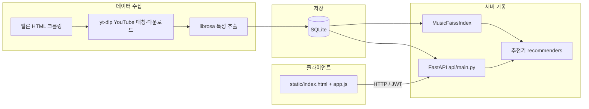

# Music Rec — 신입 개발자 가이드

이 문서는 **음악 추천 시스템 베이스 프로젝트**를 처음 맡은 분이 전체 그림을 잡고, 로컬에서 돌려 보고, 코드를 어디서 고쳐야 하는지 알 수 있도록 정리한 안내입니다.

---

## 1. 이 프로젝트가 하는 일

1. **데이터**: 멜론 차트·장르 등에서 곡 목록을 모으고, YouTube 영상과 매칭한 뒤 짧은 구간의 오디오를 분석해 **숫자 특성(MFCC, BPM 등)**을 뽑습니다.  
2. **저장**: 곡 메타와 특성을 **SQLite**에 넣습니다.  
3. **검색·추천**: 특성 벡터로 **FAISS** 인덱스를 만들어 **비슷한 곡**을 빠르게 찾습니다.  
4. **서비스**: **FastAPI**로 REST API를 제공하고, **정적 HTML/JS**로 간단한 웹 UI를 붙입니다.  
5. **사용자**: **회원가입·로그인(JWT)** 후 좋아요·재생 로그를 남기고, 그걸 바탕으로 **유저 맞춤 추천**(샘플 구현)을 시도합니다.

한 줄로 말하면: *“오디오 특성 기반 콘텐츠 유사 추천 + 사용자 인터랙션을 위한 API·UI 뼈대”* 입니다.

---

## 2. 큰 그림(아키텍처)



- **수집 스크립트**(`data/melon_pipeline.py`)는 API와 별도로 **터미널에서 한 번 실행**하는 배치에 가깝습니다.  
- **API 서버**(`uvicorn api.main:app`)가 뜰 때 DB를 읽고 FAISS를 만들거나 캐시를 로드한 뒤, `recommenders` 딕셔너리에 추천기를 넣습니다.

---

## 3. 폴더와 파일 역할

| 경로 | 역할 |
|------|------|
| `api/main.py` | FastAPI 앱: 라우트, JWT, `startup`에서 DB·FAISS·추천기 초기화, 정적 파일 마운트 |
| `data/database.py` | SQLite 연결, 테이블 생성, 곡·특성·유저·인터랙션 CRUD |
| `data/faiss_index.py` | `audio_features` 컬럼 → 벡터 정규화 → FAISS 코사인 유사 검색, `./data/faiss.index` 캐시 |
| `data/melon_pipeline.py` | 멜론 수집 → YouTube → 다운로드·특성 추출 → DB 저장 (단독 실행) |
| `algorithms/base.py` | 모든 추천기의 공통 인터페이스(`fit`, `recommend`, 선택적 `recommend_for_user`) |
| `algorithms/faiss_cbf.py` | 샘플: FAISS 유사도 + 제목/가수 키워드 검색(`search_by_query`) |
| `evaluation/metrics.py` | Precision/Recall/NDCG 등 오프라인 평가 유틸 (API와 직접 연결되지는 않음) |
| `utils/config.py` | `.env` 로드, JWT·DB 경로, 멜론 URL/장르 한도 등 설정 상수 |
| `static/` | 브라우저 UI: 로그인, 곡 그리드, 추천·검색, 플레이어, 좋아요 |

`docs/`는 README에 따르면 팀 로컬용으로 **Git에서 제외**될 수 있으니, 저장소에는 없을 수 있습니다.

---

## 4. 기술 스택(익숙해지면 좋은 것들)

| 영역 | 사용 |
|------|------|
| 언어 | Python 3.11 권장 |
| 웹 서버 | FastAPI + Uvicorn |
| DB | SQLite (`pandas`로 조회) |
| 벡터 검색 | FAISS (`faiss-cpu`) |
| 오디오 | librosa, yt-dlp, (ffmpeg 권장) |
| 인증 | bcrypt(비밀번호), PyJWT(액세스 토큰) |
| 프론트 | 바닐라 HTML/CSS/JS (빌드 도구 없음) |

`requirements.txt`에는 LangChain/LangGraph, Torch, transformers 등 **확장용** 패키지도 포함되어 있습니다. 당장 추천 API만 쓰면 그중 일부는 필수는 아닙니다.

---

## 5. 처음부터 끝까지: 로컬 실행 순서

### 5.1 가상환경과 패키지

프로젝트 루트에서:

```bash
python3.11 -m venv .venv
source .venv/bin/activate   # Windows: .venv\Scripts\activate
pip install -U pip setuptools wheel
pip install -r requirements.txt
```

macOS에서 `scikit-surprise`는 빌드 이슈가 있어 README대로 **필요할 때만** 따로 설치합니다.

### 5.2 ffmpeg

`melon_pipeline.py`가 오디오를 mp3로 뽑을 때 사용합니다.

```bash
# macOS 예시
brew install ffmpeg
```

### 5.3 환경 변수

```bash
cp .env.example .env
```

최소한 `JWT_SECRET`은 개발이 아닌 공유 환경에서는 **긴 랜덤 값**으로 바꿉니다. `DB_PATH`는 기본값 `./music_rec.db`로도 충분합니다.

### 5.4 데이터 채우기(추천이 비어 있지 않게)

FAISS는 `audio_features`에 **결측이 없는 행**만 인덱싱합니다. 특성이 없으면 `recommenders`가 비어 있을 수 있습니다.

```bash
python data/melon_pipeline.py
```

- 멜론 HTML 구조·네트워크 상태에 따라 실패하거나 곡 수가 달라질 수 있습니다.  
- 이미 특성이 있는 `song_id`는 스킵합니다.  
- 수집 범위는 `utils/config.py`의 `MELON_CHART_URLS`, `MELON_GENRE_CODES`, `MELON_MAX_SONGS_PER_*` 등으로 조절합니다.

### 5.5 API 서버

**프로젝트 루트**에서 실행해야 `static/` 경로가 맞습니다.

```bash
uvicorn api.main:app --reload
```

브라우저에서 `http://localhost:8000` — `startup`에서 DB 초기화, 곡 DataFrame 로드, FAISS 빌드/캐시 로드 후 `faiss_cbf` 등록을 시도합니다.

---

## 6. 데이터가 어떻게 흐르는지

### 6.1 `song_id`가 무엇인가?

멜론의 내부 곡 ID가 아니라, **YouTube 동영상 ID**가 `song_id`로 쓰입니다. 파이프라인이 `ytsearch`로 찾은 첫 결과의 `id`입니다.

### 6.2 DB 테이블 요약

- **`songs`**: 제목, 아티스트, YouTube URL, 썸네일, 장르 등 메타.  
- **`audio_features`**: 곡당 한 행, MFCC 13차원 + bpm, energy, spectral_centroid, zcr.  
- **`users`**: `username`, `password_hash`(bcrypt).  
- **`interactions`**: `play` / `like` / `skip` / `unlike` 로그와 타임스탬프.

좋아요 목록은 “곡마다 **가장 최근** like/unlike 중 **like**인 것만” 집계하는 SQL로 구현되어 있습니다 (`data/database.py`의 `get_user_liked_song_ids`).

### 6.3 FAISS 캐시

- 인덱스: `./data/faiss.index`  
- ID 매핑: `./data/faiss_id_map.npy`  

DB의 특성이 크게 바뀌었다면 캐시를 지우고 서버를 다시 띄워 재구축하는 것이 안전합니다.

---

## 7. API와 인증 — 프론트가 어떻게 붙는지

### 7.1 인증이 필요한 엔드포인트

헤더에 다음을 붙입니다.

`Authorization: Bearer <access_token>`

토큰은 `/api/signup`, `/api/login` 응답의 `access_token`이며, 프론트는 `localStorage`에 저장합니다 (`static/app.js`).

### 7.2 주요 엔드포인트(개념)

| 메서드 | 경로 | 설명 |
|--------|------|------|
| POST | `/api/signup`, `/api/login` | 회원가입·로그인 → JWT |
| GET | `/api/me` | 토큰으로 현재 사용자 확인 |
| GET | `/api/songs` | 목록(장르·limit 필터) |
| GET | `/api/songs/{song_id}` | 단일 곡 |
| POST | `/api/recommend` | 곡 ID + `algorithm` 키로 추천 |
| POST | `/api/recommend/user` | 로그인 유저 기준 추천 |
| POST | `/api/search` | 알고리즘이 `search_by_query`를 구현한 경우 |
| POST | `/api/interact` | play / like / skip / unlike 기록 |
| GET | `/api/likes` | 서버 기준 좋아요 목록 |
| GET | `/api/algorithms` | 등록된 알고리즘 이름 목록; 없으면 `notice` |

요청 본문의 `algorithm`은 `recommenders`의 **키**와 같아야 합니다. 샘플은 `"faiss_cbf"`입니다.

---

## 8. 추천 알고리즘을 새로 넣는 방법

1. **`algorithms/base.py`의 `BaseRecommender`**를 상속합니다.  
2. **`fit(data)`**: `get_all_songs()`와 같은 형태의 DataFrame을 받아 학습(또는 상태 준비) 후 **`self.is_fitted = True`** 를 설정합니다.  
3. **`recommend(song_id, top_k)`** → 반드시 **`{song_id: score}`** (점수 클수록 좋음).  
4. (선택) **`recommend_for_user(user_id, top_k)`**, **`search_by_query(query, top_k)`** — API가 각각 `/api/recommend/user`, `/api/search`에서 호출합니다.  
5. **`api/main.py`의 `startup()`** 안에서 인스턴스를 만들고 `recommenders["내_키"] = ...` 로 등록한 뒤 `fit(song_df)`를 호출합니다.

FAISS를 쓰려면 `startup()` 안에서 이미 만든 `MusicFaissIndex` 인스턴스를 생성자에 넘기면 됩니다. 인스턴스를 다른 함수로만 빼낼 경우, **`faiss_index` 참조가 끊기지 않게** 인자로 전달하거나 `app.state` 등에 보관하세요 (README·코멘트와 동일).

참고 구현: `algorithms/faiss_cbf.py`의 `FaissContentRecommender`.

---

## 9. 프론트엔드(`static`) 동작 요약

- 최초 로드 시 `localStorage`의 토큰으로 `/api/me`를 호출해 로그인 상태를 복구합니다.  
- `/api/algorithms`로 셀렉트 박스를 채웁니다. 알고리즘이 0개면 안내 문구가 나옵니다.  
- 홈에서 곡을 고르면 `/api/recommend`로 추천을 받고, 검색은 `/api/search`를 사용합니다 (알고리즘에 따라 동작).  
- 좋아요는 `/api/interact`로 보내고, 좋아요 탭은 `/api/likes`로 동기화합니다.

API 베이스 URL은 `app.js` 상단의 `const API = ""` 로 **같은 오리진**을 쓰는 전제입니다.

---

## 10. 자주 하는 실수와 확인 방법

| 증상 | 확인할 것 |
|------|-----------|
| 추천 API가 “알고리즘 없음” | `GET /api/algorithms`가 비어 있는지. 특성 없는 곡만 있으면 FAISS가 안 올라갑니다. 파이프라인 실행 후 재기동. |
| FAISS 초기화 실패 로그 | 콘솔의 `[API] FAISS 초기화 실패`. `faiss-cpu` 설치, DB에 특성 행 존재 여부. |
| 정적 파일 404 | `uvicorn`을 **프로젝트 루트**에서 실행했는지. |
| 멜론 파이프라인 0곡 | 멜론 페이지 구조 변경, 차단, 네트워크. User-Agent·URL은 `melon_pipeline.py`·`config.py` 참고. |
| 다운로드 실패 | `ffmpeg` 설치, 연령 제한 영상은 스킵될 수 있음. |

DB 직접 확인:

```bash
sqlite3 music_rec.db
.tables
SELECT COUNT(*) FROM audio_features WHERE bpm IS NOT NULL;
```

---

## 11. 코드 읽는 순서 추천

1. `utils/config.py` — 무엇을 환경변수로 빼 두었는지  
2. `data/database.py` — 스키마와 “좋아요” 정의  
3. `api/main.py` — `startup`과 라우트 한 번에 보기  
4. `data/faiss_index.py` — 특성 차원과 검색 의미  
5. `algorithms/faiss_cbf.py` — API가 기대하는 반환 형태  
6. `static/app.js` — 어떤 엔드포인트를 부르는지  

더 자세한 실행·API 표는 루트의 `README.md`와 함께 보면 좋습니다.

---

## 12. 용어 짧은 정리

- **CBF(Content-Based Filtering)**: 콘텐츠(여기서는 오디오 특성)가 비슷한 곡을 추천.  
- **FAISS**: 대량 벡터의 근사/정확 검색 라이브러리. 이 프로젝트는 L2 정규화 + 내적(`IndexFlatIP`)으로 코사인 유사도에 가깝게 씁니다.  
- **JWT**: 로그인 후 발급되는 서명된 토큰. 서버는 `JWT_SECRET`으로 검증합니다.  
- **Cold start**: 유저 데이터가 거의 없을 때 어떻게 추천할지에 대한 설계 이슈. `config.py`의 `COLD_START_LIMIT` 등은 확장 시 참고용 상수입니다.

---

이 가이드는 저장소 상태(파일 목록·코드)를 기준으로 작성되었습니다. 팀 내부 규칙이나 배포 방식이 있으면 그에 맞게 `README.md`와 함께 보완하면 됩니다.
