# `hybrid_faiss_cooc` 하이브리드 추천 알고리즘 정리

이 문서는 `api/main.py`에 등록된 **`hybrid_faiss_cooc`** (`HybridFaissCoocRecommender`)가 **어떤 검색·유사도 모듈을 쓰는지**, **하이브리드가 어떻게 섞이는지**, **평가는 어떻게 하는지**(앱에서는 **평가 옵션** 모달이 하이브리드 설정과 **분리**되어 있음)를 한곳에 모은 설명서입니다. 구현 근거는 주로 `algorithms/hybrid_faiss_cooc.py`, `algorithms/text_search_embed_llm.py`, `evaluation/offline_eval.py`, `evaluation/metrics.py`입니다.

---

## 1. 서버 등록 (기본 하이퍼파라미터)

`MusicFaissIndex`가 구축된 경우에만 등록됩니다.

```python
recommenders["hybrid_faiss_cooc"] = HybridFaissCoocRecommender(
    faiss_index,
    weight_content=0.55,
    weight_cooc=0.45,
    faiss_candidate_multiplier=4,
)
recommenders["hybrid_faiss_cooc"].fit(song_df)
```

| 항목 | 의미 |
|------|------|
| `weight_content` / `weight_cooc` | **서버 기본** 오디오(FAISS) vs 공동출현 비율. UI에서 보낸 `options.weights`가 있으면 **해당 요청 한 번**에만 덮어쓰고 이후 복구 |
| `faiss_candidate_multiplier` | 최종 `top_k`보다 FAISS에서 **더 넓게** 후보를 가져오는 배수. 좁으면 협업 신호만 강한 곡이 FAISS 풀 밖에 있어 하이브리드 효과가 줄어듦 |

---

## 2. “검색 엔진”에 해당하는 컴포넌트

여기서는 **정보 검색(IR)** 뿐 아니라 **유사도 검색·후보 생성**까지 포함해, 시스템에서 **후보를 가져오거나 순위를 매기는 모듈**을 정리합니다.

### 2.1 곡 기반 / 유저 기반 추천 (`/api/recommend`, `/api/recommend/user`)

| 컴포넌트 | 역할 | 구현 요약 |
|----------|------|-----------|
| **FAISS + 오디오 벡터** | 기준 곡과 **오디오 특성(MFCC·BPM 등 파이프라인 벡터)** 이 비슷한 곡 검색 | `MusicFaissIndex.search_by_id` → 코사인 유사도 상위 후보 |
| **공동출현(Co-occurrence) 그래프** | 같은 사용자 맥락에서 **함께 등장한 곡** 관계 | DB `interactions`로부터 Simple 또는 Advanced 그래프 구축 |

**기본** `recommend(song_id)`(옵션 없음)에서는 **FAISS + Cooc** 만 쓴다.  
`recommend_with_options`에 **`use_llm_search` 등 검색 관련 키**가 있으면(앱 하이브리드 설정이 그렇게 넘김), 시드 곡 **제목·가수·장르**로 질의를 만들어 `search_with_options` 점수를 합성한다 → **임베딩·LLM 확장이 추천 순위에 반영**될 수 있다.

### 2.2 자연어 검색 (`/api/search`, 하이브리드 선택 시)

`HybridFaissCoocRecommender.search_by_query_with_options`는 전부 **`TextEmbeddingSearcher.search_with_options`**에 위임합니다.

| 단계/엔진 | 역할 | 비고 |
|-----------|------|------|
| **RapidFuzz 기반 메타 유사도** | 제목·가수·장르 등과 질의 토큰의 **문자 유사도**로 1차 후보 풀 | `use_full_embedding_search=False`일 때 1단계 |
| **SentenceTransformer 임베딩** | 곡 텍스트(제목+가수+장르) 및 질의를 벡터화 후 **내적(정규화 시 코사인)** 으로 순위 | 전체 검색 또는 2단계 리랭크·일반어-only 폴백 |
| **Gemini (선택)** | 질의를 키워드로 확장해 임베딩 입력을 풍부하게 | `use_llm_search=True` 이고 API 키·라이브러리 정상일 때 |

기본 임베딩 모델은 `EmbedSearchConfig`의 **`sentence-transformers/all-MiniLM-L6-v2`** 입니다.

### 2.3 한 줄 정리

- **추천**: 오디오 **FAISS** + **Cooc**  
- **검색**: **메타 문자열 유사도** + **임베딩** (+ **LLM 쿼리 확장** 옵션)

---

## 3. 하이브리드 적용 방식 (추천 경로)

1. **Cooc 그래프 선택**  
   - `options.mode == "simple"` → 좋아요(`like`)만으로 쌍 가중 1.0  
   - 그 외(기본 `advanced`) → like/play/skip/unlike와 **시간 감쇠**로 곡별 affinity 후, 양수 곡 쌍에 \(\sqrt{aff_i \cdot aff_j}\) 누적  

2. **후보 풀**  
   - FAISS에서 `pool_size = max(top_k * faiss_mult, top_k, 1)` 만큼 조회  
   - Cooc 이웃 집합과 **합집합**  

3. **정규화**  
   - FAISS 점수·Cooc 점수를 **각각 min–max**로 \([0,1]\) 스케일 (스케일 불일치 방지)  

4. **가중합**  
   $$
   s_{\mathrm{hyb}}(i)= w_c \cdot \tilde{s}_{\mathrm{content}}(i) + w_k \cdot \tilde{s}_{\mathrm{cooc}}(i)
   $$
   \(w_c,w_k\)는 요청 `weights` 또는 서버 기본값이며, 합이 1이 아니어도 **비율 정규화** 후 사용  

5. **(선택) 시드 메타 → 텍스트 검색 합성**  
   `options`에 `use_llm_search` 등 **검색 파이프라인 키**가 하나라도 있으면 (`_SEARCH_OPTION_KEYS_FOR_RECOMMEND`), 시드 곡 메타로 질의를 만들어 `TextEmbeddingSearcher.search_with_options`를 호출하고, 검색 점수를 min–max 정규화한 뒤  
   \(s(i) = (1-\alpha)\, s_{\mathrm{hyb}}(i) + \alpha\, \tilde{s}_{\mathrm{text}}(i)\), **코드상 \(\alpha =\) `_RECOMMEND_SEED_TEXT_BLEND` = 0.35** (즉 하이브리드 0.65 · 텍스트 0.35). 후보는 합집합. 옵션 키가 없으면 생략.

6. **후처리**  
   - `threshold`: 합산 점수 하한 미만 제거  
   - `filters.genre`: 장르 일치 곡만 유지  
   - 기준 곡 자신 제거 후 상위 `top_k`  

### 유저 기반 추천

현재 좋아요한 각 곡을 seed로 위 절차를 돌린 뒤, 동일 후보에 대해 점수는 **max**로 합성해 과도한 합산을 막습니다.

---

## 4. 주요 기능

| 기능 | 설명 |
|------|------|
| **Simple / Advanced Cooc** | 협업 신호의 거칠기·정교함 선택 |
| **요청별 가중치** | UI 슬라이더로 오디오↔협업 비율 조절 |
| **임계값·장르 필터** | API 옵션으로 노출 |
| **자연어 검색 파이프라인** | 임베딩·메타검색·LLM 확장 조합 (`text_search_embed_llm.py`) |
| **오프라인 평가 연동** | `eval_mode`에 따라 `search_by_query_with_options` 또는 `recommend_with_options` (아래 5절). 앱에서는 **평가 옵션** 모달로 모드·검색어·시드·계정 범위를 지정 |

---

## 5. 평가 지표 — 정의와 코드에서의 계산

오프라인 평가는 **`evaluation/offline_eval.py`** 가 케이스를 만들고, **`evaluation/metrics.py`** 가 지표를 계산합니다.  
요청 `options`에서 **`strip_eval_request_meta`** 로 제거되는 메타 키만 알고리즘에 넘기지 않습니다: `eval_only_current_user`, `run_variants`, `max_cases`, `k_list`, **`eval_mode`**, **`search_eval_query`**, **`eval_seed_song_id`**.

### 5.0 평가 모드 (`eval_mode`)

| 모드 | 기본값 | 순위 얻는 방법 | 정답(relevant) |
|------|--------|----------------|----------------|
| **`search`** | ✅ 기본 | `search_by_query_with_options(search_eval_query, top_k, options)` | 해당 유저의 **좋아요 전체** (좋아요 1곡 이상인 유저만 케이스) |
| **`recommend`** | | `recommend_with_options(query_song_id, top_k, options)` | leave-one-out (5.1) |

- **검색 모드**는 알고리즘이 **`search_by_query_with_options`를 구현**해야 하며 (`hybrid_faiss_cooc`만 해당, `faiss_cbf` 등은 불가). `search_eval_query`가 비면 API가 400을 반환한다.  
- **추천 모드**에서 **`eval_seed_song_id`** 가 있고 **`eval_only_current_user`** 로 유저가 고정되면: 그 유저의 좋아요에 있는 **그 곡만** 시드로, 정답은 **나머지 좋아요**. 시드만 지정하고 전체 DB면 `(user, 시드)`가 해당 시드인 leave-one-out 케이스만 남긴다. 비우면 5.1대로 전체(또는 `max_cases`로 자름).

API 응답에 **`eval_eval_mode`** 가 포함되어 UI가 모드를 구분한다.

### 5.0a 앱 UI: 평가 옵션 (하이브리드 설정과 분리)

**기준(검색어 vs 기준곡)**, **평가용 검색 문장**, **기준곡(시드) 1곡**, **현재 로그인 계정만 평가** 여부는 **하이브리드 설정 모달과 별도**로 둔다.

| UI 위치 | 역할 |
|---------|------|
| 사이드바 **「평가 옵션」** | 위 네 가지를 고르는 **전용 모달**을 연다. |
| **평가 실행** 모달 | 현재 적용 중인 옵션 **요약** + **「평가 옵션…」** 으로 같은 모달을 연다. **실행**은 저장된 옵션으로 `POST /api/eval/run` 을 보낸다. |

클라이언트는 **`localStorage` 키 `music_rec_eval_settings_v1`** 에 `{ eval_mode, search_eval_query, eval_seed_song_id, eval_only_current_user }` 를 유지한다. 검색 모드에서 저장된 문장이 비어 있으면 **메인 검색창**(`search-input`) 값을 보조로 쓴다. 비로그인이면 **내 계정만** 체크는 비활성·해제되고, 로그아웃 시 해당 플래그는 저장값에서도 꺼진다.

### 5.1 케이스(정답 정의) — `eval_mode=recommend` 일 때만

- **좋아요 leave-one-out**: 유저 좋아요 ≥ 2 — 한 곡을 쿼리, 나머지 좋아요를 **relevant**  
- **재생 기반**: `play`이면서 `play_seconds` ≥ 20 인 서로 다른 곡이 2곡 이상인 유저에 대해 동일 구조  
- 두 소스를 합치되 **(user, query_song) 중복은 좋아요 쪽 우선**

### 5.2 지표 (K는 보통 5, 10, 20)

| 지표 | 의미 |
|------|------|
| **Precision@K** | 추천 상위 K개 중 relevant에 속한 비율 ÷ K |
| **Recall@K** | relevant 중 상위 K에 걸린 비율 ÷ \|relevant\| |
| **NDCG@K** | relevant가 **위쪽 순위**에 올수록 높아지는 순위 품질 (이상적 순서 대비 정규화) |

**추천 평가**(`eval_mode=recommend`): **`recommend_with_options(query_song_id, top_k≥max(K), options)`** 로 순위를 얻는다. `options`에 검색 파이프라인 키가 있으면 같은 호출 안에서 **시드 메타 → `search_with_options` 합성**(3절)이 실행된다. HTTP 라우터의 `POST /api/search`를 직접 부르지는 않지만, 검색 모드 평가는 **같은 `search_by_query_with_options` 경로**를 쓴다.

**검색 평가**(`eval_mode=search`): **`search_by_query_with_options`** 만으로 순위를 얻고, 지표는 동일 공식으로 계산한다.

UI **표보기**(`run_variants=true`)에서는 하이브리드일 때 **Simple/Advanced × LLM on/off** 네 조합을 같은 케이스로 돌린다.  
- **검색 모드**: 네 조합은 **검색 옵션**(`mode`·`use_llm_search` 등)으로 `search_by_query_with_options`에 전달된다.  
- **추천 모드**: 네 조합은 **`recommend_with_options`** 의 공동출현·LLM 등에 전달된다.  
가중치·threshold는 요청에 실려 있으나, **검색 순위 자체에는 추천 가중치가 직접 쓰이지 않는다**(앱 안내와 동일).

### 5.3 오프라인에서 비교하는 것

이 평가는 **미래 라벨 예측**이 아니다. **한 번에 하나의 순위 리스트**(검색 결과 또는 추천 결과)와, 정해진 **relevant** 집합의 교집합·순위로 지표를 낸다.  
- **검색 모드**: “이 검색어로 나온 상위 K가 내 좋아요를 얼마나 포함·위에 두는가”  
- **추천 모드**: “이 시드 곡에 대한 추천 상위 K가 leave-one-out 정답을 얼마나 맞추는가”  

숫자·표는 앱 **평가 실행 모달**에서 확인한다. **무엇을 기준으로 돌릴지**는 **평가 옵션** 모달(사이드바 또는 실행 모달의 「평가 옵션…」)에서 고른 뒤 **적용**으로 반영한다.

> **LLM·네 조합이 수치에 남느냐:** 과거 6.4 기록과 **최근 평가 모달 실측(6.5)** 모두, **반영(on)·미반영(off)** 행이 동일한 경우가 많다. **검색 모드**에서도 Simple/Advanced × LLM 네 조합이 **같은 수치**로 나온 실행이 있었다(6.5) — 검색 경로는 공동출현 `mode`를 쓰지 않기 때문이다. 추천 모드에서는 **Simple vs Advanced**만 의미 있는 차이가 난다. LLM 차이를 보려면 쿼리 확장이 실제 순위를 바꿔야 하며, Gemini 미가동·확장 무효 등으로 같아질 수 있다.

---

## 6. 실험 정리 및 결과 기록

실험 정리란 **한 번의 실행(또는 한 묶음의 비교)** 마다 남기는 **조작 변수·통제 변수·출력 지표·근거 그림 경로**의 대응이다. 표·본문에 적는 수치는 **해당 실행의 `/api/eval/run`·표보기 출력**과 일치해야 한다.

### 6.1 기록 항목 (실험 로그에 둘 것)

| 항목 | 설명 |
|------|------|
| **실행 맥락** | DB 스냅샷·날짜(선택), 알고리즘 키, 사용한 \(K\) 목록 |
| **조작 변수** | 이번에 바꾼 것만 (예: 공동출현 모드, `weight_content`/`weight_cooc`, `threshold`) |
| **통제 변수** | 위 항목 외에 고정한 설정 |
| **요약 결과** | 표보기 요약 표의 조합별 Precision@K / Recall@K / NDCG@K (실행 결과에서 복사) |
| **표본** | `n_cases` (표보기 상단·요약에 표시) |
| **근거 그림** | 6.4(도식)·6.5(실측 스냅샷) 등 해당 파일명 |

### 6.2 비교 단위 (실험 구간)

인과를 나누어 적기 쉽도록, **한 구간에서는 조작 축을 하나**로 두고 나머지는 통제 변수로 고정하는 방식이 일반적이다.

### 6.3 조작 축 ↔ 6.4 삽입란

| 조작 축 | 통제(고정) | 대응하는 그림 슬롯 (6.4) |
|---------|------------|-------------------------|
| **공동출현 모드** (Simple / Advanced) | 가중치, threshold | 그림 A |
| **가중치** (오디오 % ↔ 협업 %) | 모드, threshold | 그림 B-1 ~ B-3 |
| **threshold** | 모드, 가중치 | 그림 C-1 ~ C-3 |
| **검색 LLM on/off** | (표보기·`eval_mode=search`) **`search_by_query_with_options`** 에 `use_llm_search` 전달 · (표보기·`eval_mode=recommend`) 시드 메타 검색 합성 시에도 검색기로 전달 · (그림 D) 자연어 질의로 **검색 UI**만 비교할 때 |

### 참고: 표보기 / 평가 모달

위 표는 실험 설계·기록용이다.

| 주제 | 내용 |
|------|------|
| **평가 대상** | **평가 옵션** 모달에서 고른다. 기본 저장값은 **`eval_mode=search`**(검색어·정답=좋아요). **기준곡(추천)** 을 고르면 **`recommend_with_options`** leave-one-out 평가. **DB 전체 vs 현재 계정만** 도 같은 모달의 **`eval_only_current_user`** 로 넘어간다. 요청 본문의 `options`에는 5.0과 동일하게 `eval_mode`·`search_eval_query`·`eval_seed_song_id`·`eval_only_current_user` 가 실린다. **가중치·Cooc 모드·LLM·threshold** 는 **하이브리드 설정** 쪽이다. |
| **LLM 열** | **6.4·6.5:** 추천·검색 오프라인 모두 **반영(on)·미반영(off) 행이 동일**한 실행이 기록되었다(아래 6.5). 이론상 검색 모드에서 LLM이 쿼리를 바꾸면 달라질 수 있으나, 해당 실행에서는 그렇지 않았다. 자유 질의 체감은 **그림 D**(`/api/search`)가 여전히 유효하다. |
| **그림 D** | 검색 UI (`/api/search` 결과 화면). 질의문·옵션을 고정한 뒤 LLM on/off 각각의 화면을 D-1, D-2에 대응시킨다. |
| **한 실행 안의 네 조합** | 하이브리드 변형 실행 시 **평가 실행** 모달에서 Simple/Advanced × LLM on/off **네 조합**을 한 번에 요약 표·차트로 낸다. (평가 **기준**은 **평가 옵션**에서 고정.) **검색 모드**에서는 검색 파이프라인에, **추천 모드**에서는 추천·시드 텍스트 합성에 각각 반영된다. |
| **가중치 스윕 예** | B 슬롯용으로 흔히 80/20, 55/45, 20/80 등 **세 번** 저장·실행한 뒤 각각 캡처를 B-1~3에 넣는다. |
| **threshold 스윝** | C 슬롯용으로 낮음·중간·높음 등 **세 번** 실행한다. UI에서 **50%는 값 0.5**에 해당한다. threshold는 낮은 점수 후보를 잘라 순위가 바뀐다. |
| **캡처에 넣을 요소** | 요약 표·막대 차트, 가능하면 **상단 설정 요약**과 **n_cases**. 표본이 작으면 지표 분산이 커질 수 있다. |
| **Advanced vs Simple** | DB에 play·skip·unlike·타임스탬프가 많을수록 두 모드의 점수 차이가 커지는 경우가 많다. |

### 6.4 오프라인 평가 그림 삽입란

경로는 모두 **`figures/hybrid_faiss_cooc_eval/`** 기준이다. 각 그림 직후 **기록란** 표는 6.1의 실행 맥락·조작·통제 변수를 채우기 위한 필드이다.

#### 하이브리드 설정 (오디오↔협업·threshold·Cooc·검색 파이프라인)

평가 **기준**(검색어/기준곡·범위)은 이 화면이 아니라 **평가 옵션** 모달이다. 아래 캡처는 알고리즘 하이퍼파라미터 위주.

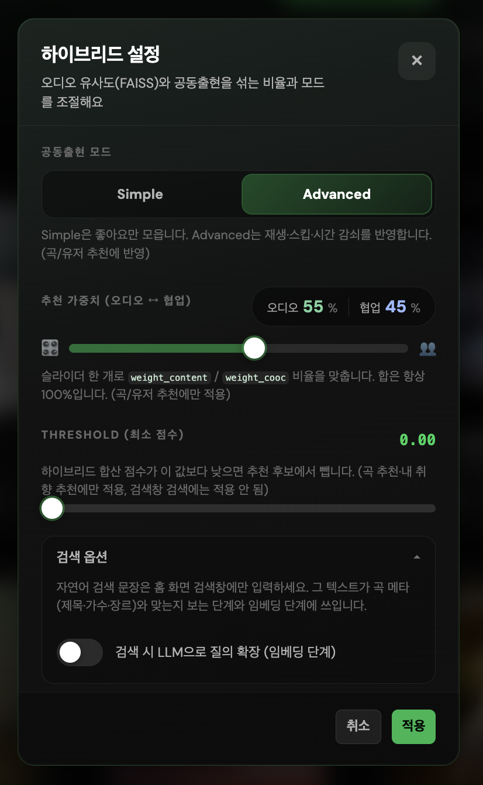

#### 가중치 스윕 (모드·threshold 고정)

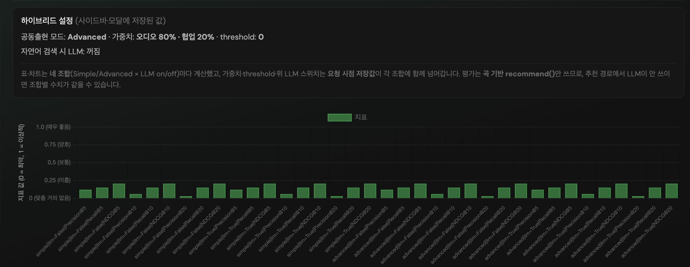

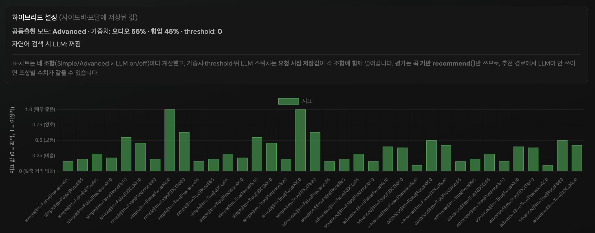

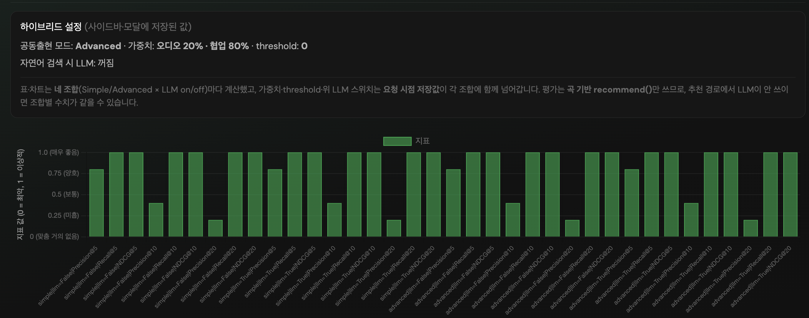

**가중치 스윕 분석**  
**threshold 0**으로 고정하고, 오디오 % / 협업 %만 **80/20 · 55/45 · 20/80**으로 바꿔 각각 표보기 **네 조합** 케이스별 표를 실행한 결과에 대한 해석이다.

| 가중치 (오디오 / 협업) | 한 줄 요약 |
|------------------------|------------|
| **80 / 20** | 오디오(FAISS) 비중이 클 때 **가장 불리**했다. IU·10CM은 약한 고정 패턴(예: P@5=0.2, R@5=0.25)에 머물고, **카더가든**은 NDCG만 조금 다른 유사 패턴이다. **한로로·BANG BANG은 모든 K에서 지표 0** — 정답 곡이 상위 추천에 거의 오르지 않는다. 이 로그·유저에서는 **협업 신호를 20%만 섞은 것으로는** leave-one-out 정답을 잡기에 부족했다고 볼 수 있다. |
| **55 / 45** | 중간 비율에서 **쿼리별·모드별 차이**가 드러난다. 너에게 닿기를·한로로 등은 K를 키우면 Recall이 살아나고, **한로로**는 Advanced가 Simple보다 K=10에서 P/R/NDCG가 낮아지는 등 **공동출현 그래프 선택 효과**가 보인다. **BANG BANG**은 Simple만 K=20에서 맞춤이 생기고 Advanced는 매우 낮다 — **같은 가중치에서도 모드 민감 쿼리**가 존재한다. |
| **20 / 80** | 협업 비중이 클 때 **이번 케이스 집합에서는 지표가 포화**에 가깝다. 표에 나온 **다섯 쿼리 모두**에서 P@5=0.8, R@5=1, NDCG@5=1 등으로 동일하고, **Simple/Advanced·LLM on/off 구분 없이** 같은 숫자다. 정답 4곡이 상위 5 안에 **거의 항상** 들어오는 순위가 된 셈이다(상한 때문에 P@5=1에는 못 미침). |

**정리:** 이 DB·`user_id=2`·threshold=0 기준으로는 **협업 쪽 가중치를 높일수록** 오프라인 맞춤은 좋아지고, **오디오 쪽을 높일수록** 일부 쿼리에서 **완전 미스(전 K 0)**까지 간다. 다만 20/80에서 지표가 **쿼리 간에도 평탄**해지는 것은, **공동출현이 이 유저의 좋아요·재생 기반 정답 집합과 강하게 맞물린다**는 뜻으로 읽을 수 있고, **다른 유저·콜드 스타트 곡**에서는 과한 협업 비중이 **다른 종류의 오류**(인기 편향 등)를 키울 수 있으니 **가중치 스윕을 여러 데이터로 반복**하는 편이 안전하다.

#### threshold 스윕 (모드·가중치 고정)

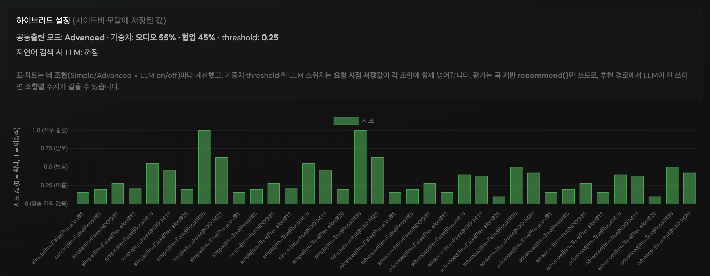

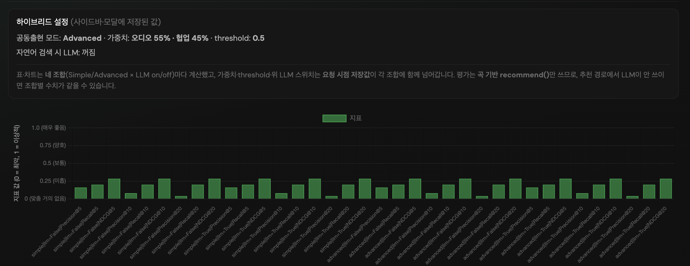

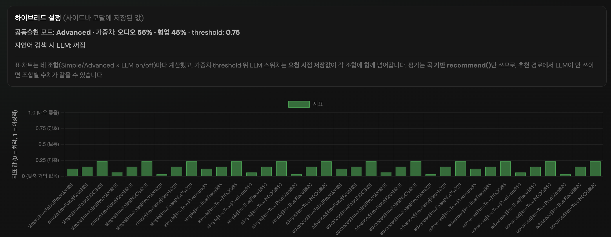

**threshold 스윕 분석 (실행 예시)**  
아래는 **가중치 55/45·고정**, 표보기 **네 조합** 케이스별 표를 세 번 실행해 얻은 결과에 대한 해석이다.

| threshold | 한 줄 요약 |
|-----------|------------|
| **0.75 (높음)** | 대부분 케이스에서 상위 K에 정답이 거의 잡히지 않는다. IU·10CM·카더가든 세 쿼리는 모든 조합에서 **동일한 약한 패턴**(예: P@5=0.2, R@5=0.25, K가 커져도 R@20=0.25로 정체됨)만 보이고, **한로로·BANG BANG은 모든 K에서 지표 0**이다. 후보가 점수 하한에 많이 걸러져 **리스트가 비었거나 정답이 상위권 밖**으로 밀린 상태로 읽는 것이 타당하다. |
| **0.5 (중간)** | 위 세 쿼리(IU·10CM·카더가든)는 **0.75와 숫자가 같다** — 이 구간만으로는 threshold 완화 효과가 이 케이스들에는 나타나지 않았다. **한로로**는 NDCG만 0.3904→0.2463으로 달라져 **순위 형태는 조금 달라졌지만**, P/R은 여전히 낮다. **BANG BANG은 여전히 전 구간 0**이다. |
| **0.25 (낮음)** | **너에게 닿기를·한로로**에서 K=10 근처부터 Recall이 살아난다(예: R@10=1, P@10=0.4 등). **한로로**는 Advanced가 Simple보다 K=10에서 P/R/NDCG가 낮아져 **공동출현 그래프 차이가 드러난다**. IU·카더가든·10CM도 K=20에서 R@20=1 등으로 완화된다. **BANG BANG**은 Simple에서만 K=20에 맞춤이 생기고(예: R@20=1, NDCG@20≈0.38), Advanced는 여전히 매우 낮다 — **같은 threshold에서도 모드에 따라 이 쿼리만 격차가 큼**. |

**정리:** 이 DB·이 유저·이 가중치에서는 **threshold를 0.75→0.5로만 낮춰서는** 케이스별 표상 이득이 거의 없고, **0.25 근처까지 낮춰야** 오프라인 지표가 의미 있게 움직인다. 다만 threshold를 내릴수록 **후보 수·순위가 민감**해지므로, 요약 표·차트와 함께 **과도하게 낮추면 노이즈 후보 증가** 가능성은 구현·데이터에 따라 별도로 본다.

#### 검색 LLM on/off


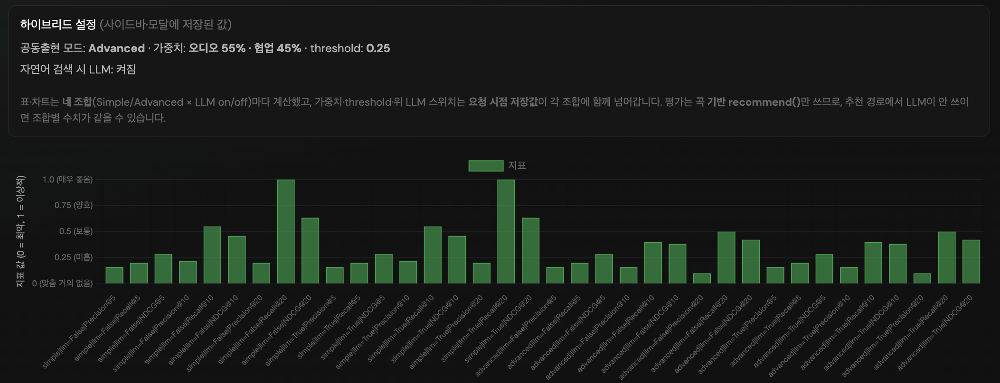

**질문(과거 기록):** 시드 메타 → `search_with_options` 합성이 켜진 채 **추천** 오프라인 표보기만 돌렸을 때, **LLM 반영(on)과 미반영(off)** 으로 **지표가 갈라지는가?**

**답(당시 실측 기록):** **아니오(해당 DB·유저·케이스에서는).**  
가중치 **55/45**, **threshold 0.25**, 공동출현 **Advanced** 등으로 돌렸을 때, **한 실행 안**에서 미반영/반영 행이 동일했다는 관찰이 있었다. **주의:** 앱 기본 저장값은 **`eval_mode=search`**(평가 옵션)이므로, **검색어 오프라인 평가**에서는 같은 현상이 반복된다고 가정하면 안 된다.

**구현:** `recommend_with_options`는 `options`에 `_SEARCH_OPTION_KEYS_FOR_RECOMMEND` 중 하나라도 있으면 시드 **제목·가수·장르**로 `TextEmbeddingSearcher.search_with_options`를 부르고, \((1-\alpha)\) s_hyb + \(\alpha\) s_text, **\(\alpha=0.35\)** 로 합친다. `use_llm_search`는 검색기로 전달된다. **검색 모드 평가**는 사용자가 입력한 **`search_eval_query`** 로 `search_by_query_with_options`를 직접 호출한다.

| 관찰 (당시·추천 오프라인 위주) | 내용 |
|------|------|
| **반영 vs 미반영** | 위 DB/유저/설정에서는 **지표 차이 없음**으로 기록됨. |
| **사이드바 LLM 켜짐 vs 꺼짐** | 두 번 전체 실행 **표 동일**으로 기록됨. |
| **Simple vs Advanced** | 한로로·BANG BANG·IU·10CM·카더가든 등에서 **모드에 따라 지표는 다름** — 공동출현 쪽은 분리되어 있음. |

**왜 수치가 같을 수 있는가(가설):** `use_llm_search=True`여도 **질의**에서 **LLM 확장이 실질적으로 바꾸는 게 없거나**, 1단계 RapidFuzz 위주면 **추천 합성**·**검색** 모두에서 on/off가 같아질 수 있다. **검색 오프라인**에서 Simple/Advanced까지 같게 나오는 이유는 **별도 6.5** 참고. **그림 D**는 UI의 `POST /api/search` 비교용이다.

### 6.5 평가 모달 실측 스냅샷 (분석 기록)

아래는 **동일 DB·UI에서 연속 실행한 결과**를 붙여 넣어 정리한 것이다. 알고리즘 `hybrid_faiss_cooc`, **가중치 55/45**, **threshold 0**, 사이드바 **LLM 꺼짐**, 변형 실행 시 **Simple/Advanced × LLM on/off** 네 조합. **기준곡·검색어·「현재 계정만」** 은 당시 **평가 옵션**에서 지정한 값이다: 기준곡 **한로로 「사랑하게 될 거야」** (`h0KIWaUEIgQ`), 검색어 **「새벽에 듣기 좋은 노래」**.

#### (1) 기준곡(추천) 평가 — 시드만 고정

| 실행 | 풀(전체/필터/계산, UI 표기) | 표에 보이는 행 |
|------|---------------------------|----------------|
| **현재 계정만** (`user_id=3`) | 7 / 2 / 2 | **4행** = 네 조합(Simple/Advanced × LLM) × **유저 3 한 건** · 정답 **1곡** |
| **DB 전체 유저** | 7 / 7 / 7 | **8행** = 2명의 유저(`user_id` 2·3) × 네 조합 · 시드 `h0KIWaUEIgQ` 포함 케이스만 |

**공통 관찰 — LLM 열:** 네 조합 각각에서 **미반영(off) = 반영(on)** 이 **항상 동일**. 시드 메타 텍스트 합성 경로에서도 이 실행에선 확장이 순위를 바꾸지 않은 것으로 읽는다.

**공통 관찰 — Simple vs Advanced (추천만 해당):**

- **`user_id=3`, 정답 1곡**  
  - **Simple:** `@5` 전부 0 → 정답이 상위 5 밖. `@10`에서 P=0.1, R=1, NDCG≈0.33.  
  - **Advanced:** `@5`~`@10` 전부 0 → 작은 K에서 더 약함. `@20`에서만 R=1, NDCG≈0.24로 일부 회복.  
  → **같은 유저·같은 시드**에서 **Simple 공동출현**이 이 케이스에선 **상위 K에 유리**.

- **`user_id=2`, 정답 4곡** (전체 풀 실행 중 한 행)  
  - Simple이 `@10`에서 R=1, NDCG≈0.60 수준.  
  - Advanced는 `@10`에서 P·R·NDCG가 Simple보다 **낮음** (예: R@10 0.5).  
  → **정답 수·로그가 많은 유저**에서도 모드에 따라 순위가 갈린다. **Advanced가 항상 우수하지는 않음**.

- **`user_id=3` 행**은 전체 풀에서도 위와 동일 패턴(7건 중 4조합×해당 유저).

#### (2) 검색어 평가 — 동일 문장

| 실행 | 풀(전체/필터/계산, UI 표기) | 표에 보이는 행 |
|------|---------------------------|----------------|
| **내 계정만** (`user_id=3`) | 2 / 1 / 1 | **4행** · 정답 좋아요 **2곡** |
| **DB 전체** | 2 / 2 / 2 | **8행** · `user_id=3`(정답 2곡), `user_id=2`(정답 5곡) 각각 네 조합 |

**관찰 — 네 조합 전부 동일 수치:** 각 `(user_id, 검색어)` 안에서 **Simple = Advanced**, **LLM off = on** 이 **완전히 같음**.  
**해석:** `search_by_query_with_options`는 **텍스트 파이프라인**으로 순위를 매기며, 옵션의 **`mode`(simple/advanced)** 는 **공동출현 그래프 선택**용이라 **검색 점수 계산에 관여하지 않는다**. 따라서 검색 오프라인 표에서 네 줄이 같게 나오는 것은 **구현과 일치**. LLM이 꺼져 있거나 확장이 동일하면 당연히 같다.

**관찰 — 유저 간 차이:** `user_id=2`(정답 5곡)는 `user_id=3`(정답 2곡)보다 P@5 등이 높게 나옴 — **정답 집합 크기·좋아요 구성**이 지표에 직접 반영됨(Recall 분모·적중 개수).

#### (3) 문서·UI에 반영할 메모

1. **평가 모드별 안내 문구:** 검색 모드일 때는 **「네 조합이 `search_by_query`에만 영향, Cooc mode는 검색 순위에 안 탄다」** 를 사용자에게 알려 두면 표의 **동일 숫자 4줄**이 혼란스럽지 않다.  
2. **추천 모드**에서만 **Simple vs Advanced** 비교가 오프라인 표에서 의미 있다.  
3. **기준곡만 고르고 DB 전체**로 돌리면, 시드를 좋아요에 포함한 **유저 수만큼**만 행이 생긴다(본 스냅샷에서는 7건 풀 중 실질 2유저×4조합 등).  
4. 본 스냅샷의 **threshold=0** 은 과거 6.4 본문의 **0.25 실험**과 다르다 — 수치를 논문·발표에 쓸 때는 **설정 한 줄을 항상 붙일 것**.

---

### 6.6 시스템 아키텍처 (Mermaid)

#### 전체: API → 추천 vs 검색

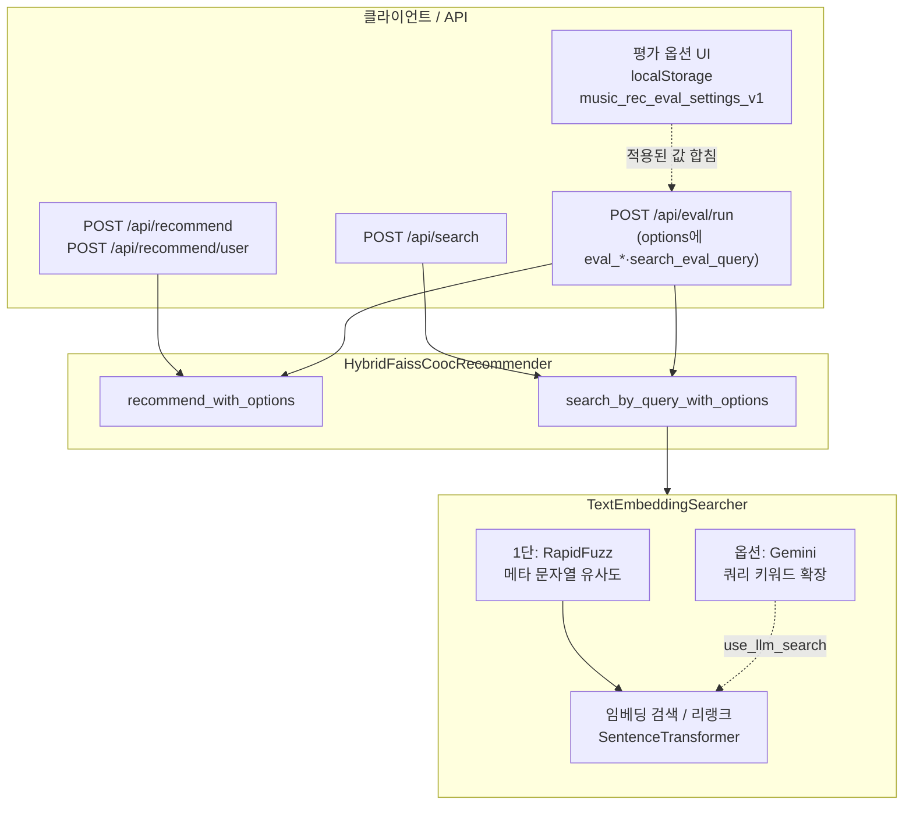

#### 추천 경로: FAISS + Cooc 하이브리드

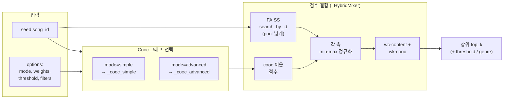

#### 검색 경로: 옵션에 따른 분기 (요약)

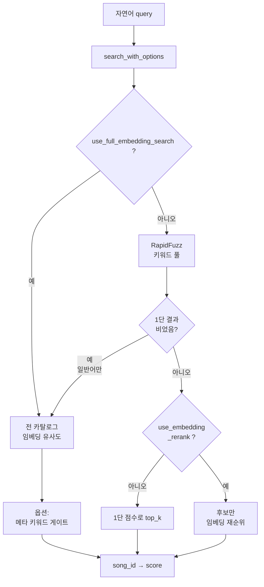

#### `fit` 시 데이터 흐름

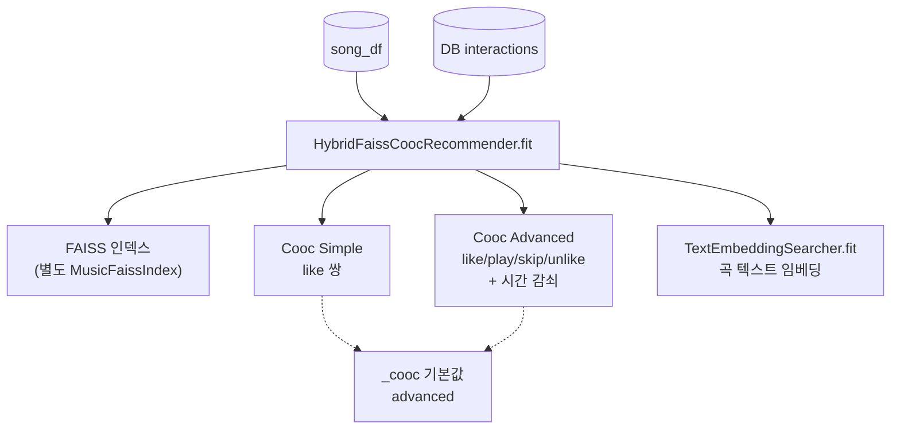

#### 오프라인 평가 (`/api/eval/run`) 분기 요약

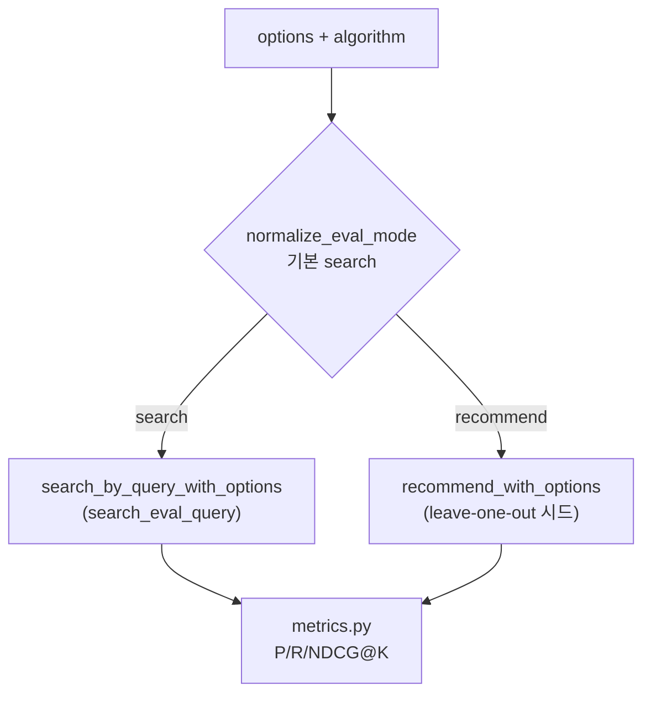

---

## 7. 추가로 정리할 만한 포인트

| 주제 | 요약 |
|------|------|
| **학습 여부** | 딥러닝 **경사 하강 학습 루프는 없음**. FAISS 인덱스·Cooc 그래프·임베딩은 **데이터로부터 구축·갱신** |
| **콜드 스타트** | 신규 곡은 Cooc 약함 → FAISS(오디오) 비중이 상대적으로 중요 |
| **Cooc 비용** | 좋아요가 많은 유저는 Simple에서 쌍이 많아질 수 있음 (문서화된 주의) |
| **검색 vs 추천 평가** | 오프라인은 **`eval_mode`** 로 **검색어**(정답=좋아요) 또는 **기준곡 추천**(leave-one-out)을 고를 수 있다. **평가 옵션** 모달에서 지정·저장되며, 기본 저장값은 검색 모드 |
| **재현성** | 동일 DB 스냅샷·동일 `fit` 시점에서 지표를 비교할 것 |
| **검색 오프라인 네 조합** | **6.5:** 동일 수치 4줄은 정상에 가깝다. `mode`는 추천용 Cooc 선택이며 검색 랭킹에는 안 탄다 |

---

## 8. 관련 파일

| 파일 | 역할 |
|------|------|
| `algorithms/hybrid_faiss_cooc.py` | 하이브리드 추천·Cooc·검색 위임 |
| `algorithms/text_search_embed_llm.py` | 메타검색·임베딩·LLM 확장 |
| `data/faiss_index.py` | 오디오 벡터 FAISS 검색 |
| `evaluation/offline_eval.py` | 케이스 생성·실행 |
| `evaluation/metrics.py` | Precision / Recall / NDCG |
| `api/main.py` | 등록·`/api/eval/run` (`eval_mode`·검색어·시드 검증, `eval_eval_mode` 응답) |
| `static/app.js` | 하이브리드 모달, **평가 옵션**(`evalSettings`·`music_rec_eval_settings_v1`), 평가 실행·표/차트, `runEvaluation` 이 저장된 평가 옵션으로 `options` 구성 |
| `static/index.html` | 하이브리드 설정 마크업, **`eval-settings-modal`(평가 옵션)**, `eval-modal`(실행·요약) |

---

